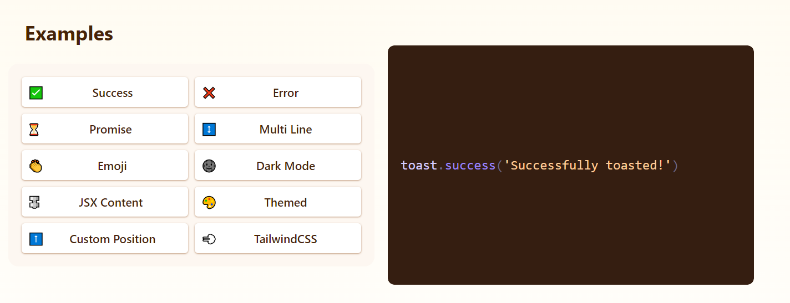

### React Hot Toast
-----------------------------------------------------------------
`npm install react-hot-toast` 

```Javascript
import toast, { Toaster } from 'react-hot-toast';

const notify = () => toast('Here is your toast.');

const App = () => {
  return (
    <div>
      <button onClick={notify}>Make me a toast</button>
      <Toaster />
    </div>
  );
};
```



# Docs
- https://react-hot-toast.com/docs
- https://github.com/timolins/react-hot-toast?tab=readme-ov-file